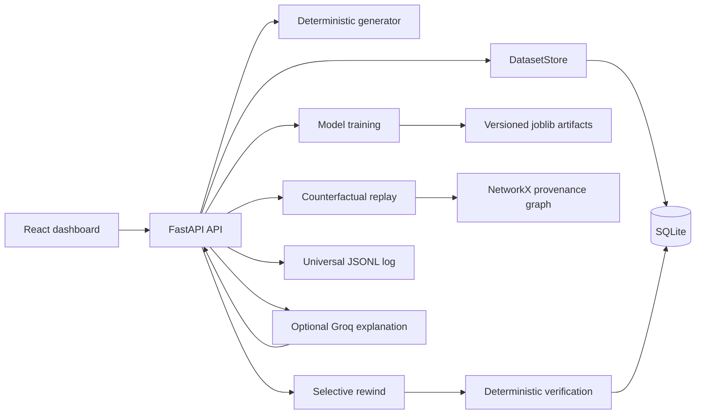
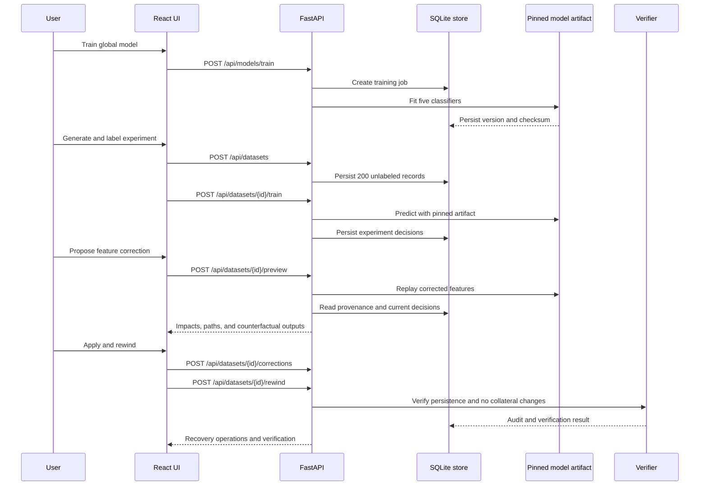

# DECISION-REWIND

DECISION-REWIND is a deterministic cybersecurity research prototype for identifying downstream decisions affected by corrected historical data, replaying those decisions with a pinned model, selectively rewinding only impacted outputs, and verifying the resulting state.

> **Project status:** Research prototype / SIC Capstone Project.
>
> **Team members:**
>
> - Bhargav M — `1RN24CY009`
> - Saichetan M — `1RN24CY040`
> - Raghavendra Bhat B S — `1RN24CD057`
> - Shreya B K — `1RN24CD080`

## Overview

Security operations pipelines often make several dependent decisions from the same event data. If an upstream value is later corrected, recomputing every decision can create unnecessary or unsafe changes. DECISION-REWIND demonstrates a narrower workflow:

1. Generate deterministic synthetic cybersecurity events.
2. Train versioned classifiers on a 20,000-record training dataset.
3. Create a separate 200-record experiment pinned to one trained model artifact.
4. Correct one or more supported event features.
5. Replay the frozen model counterfactually.
6. Use provenance reachability and output differences to identify affected decisions.
7. Rewind only affected decisions.
8. Persist the correction, recovery, audit history, and deterministic verification result.
9. Optionally ask an evidence-grounded Groq-backed assistant to explain the persisted state.

The LLM is deliberately outside the recovery authority boundary: it can explain evidence, but it cannot approve, execute, or override recovery.

## Features

### Dataset and experiment workbench

- Deterministic synthetic cybersecurity event generation with configurable seeds.
- Global model training on exactly 20,000 records using a stratified 80/20 split.
- Explicit creation of 200-record experiment datasets after a global model exists.
- Separate experiment labeling step using the experiment's pinned, frozen model artifact.
- Search, sorting, pagination, selectable columns, event details, and editable feature proposals in the dashboard.
- Historical event and decision state preserved separately from current state.

### Decision modeling

Five downstream decisions are modeled:

| ID | Decision | Classifier | Main inputs |
| --- | --- | --- | --- |
| D1 | Authentication | Logistic Regression | Failed logins, login hour, geo anomaly, source IP trust |
| D2 | Threat Severity | Random Forest | Failed logins, threat intelligence score, previous alerts |
| D3 | Asset Protection | Decision Tree | Asset criticality, threat intelligence score, previous alerts |
| D4 | Incident Escalation | Logistic Regression | Threat intelligence score, geo anomaly, asset criticality, D2 severity |
| D5 | Response Action | Random Forest | D2 severity, asset criticality, geo anomaly, failed logins |

- Training and validation loss and accuracy are stored for each model fit.
- Model versions, training dataset IDs, metadata, and SHA-256 artifact checksums are persisted.
- D2 is evaluated before downstream D4 and D5 because those models consume D2 severity.

### Counterfactual replay and selective recovery

- Multi-feature correction previews.
- Validation for supported feature names and value ranges.
- Counterfactual comparison of historical, current, and replayed outputs.
- NetworkX provenance graph for feature-to-decision reachability.
- Dependency paths displayed in the UI.
- Recovery limited to decisions that both changed under replay and are reachable from a corrected feature.
- Historical outputs remain immutable during recovery.

### Verification and observability

- Deterministic verification of correction and recovery persistence.
- Detection of collateral changes and mismatched event/decision state.
- Dataset-scoped workflow audit records.
- Universal JSON Lines application log covering backend, frontend, API, model, workflow, and LLM events.
- Redaction of credential-like keys and API/bearer key patterns before log persistence.
- Bounded, filtered log context for AI explanations.

### Optional AI explanations

- Groq through the OpenAI-compatible Responses API.
- Evidence assembled from persisted experiment state, model metadata, corrections, provenance, recovery, verification, audit history, and filtered Universal Logs.
- AI status endpoint that reports provider/model configuration without exposing the API key.
- Explicit errors when the provider is not configured or unavailable; no fabricated fallback response.

## Tech Stack

| Area | Technology | Version / evidence |
| --- | --- | --- |
| Backend API | FastAPI | `0.111.0` |
| ASGI server | Uvicorn | `0.30.1` |
| Validation and schemas | Pydantic | `2.9.2` |
| Persistence | SQLite via Python `sqlite3` | Built into Python; database created at runtime |
| Data and numerical computing | pandas, NumPy | `2.2.3`, `2.2.1` |
| Machine learning | scikit-learn | `1.5.2` |
| Model artifacts | joblib | `1.6.0` |
| Provenance graph | NetworkX | `3.6.0` |
| Optional LLM client | OpenAI SDK with Groq-compatible endpoint | `1.76.0` |
| Frontend | React, React DOM | `18.3.1` |
| Frontend language | TypeScript | `5.5.4` |
| Frontend build tool | Vite | `5.4.2` |
| Graph visualization | React Flow | `11.4.2` |
| Charts | Recharts | `2.12.7` |
| Styling/build support | Tailwind CSS, PostCSS, Autoprefixer | `3.4.13`, `8.4.47`, `10.4.20` |
| Testing | pytest, HTTPX | `8.3.3`, `0.27.2` |
| Container development | Docker Compose | Compose file version `3.9`; Python `3.11-slim`, Node `20-alpine` |

## Architecture Overview

The repository contains two independently run applications:

- **Backend:** FastAPI routes coordinate dataset storage, model training, replay, provenance, recovery, verification, audit logging, and optional AI explanations.
- **Frontend:** A React dashboard calls the backend API, displays experiment state and decision impacts, renders provenance with React Flow, and exposes the correction/rewind workflow.



### End-to-end workflow



## Project Structure

```text
Decision_Rewind/
├── backend/
│   ├── app/
│   │   ├── counterfactual/  # Replay and impact analysis
│   │   ├── dataset/         # Deterministic event generation
│   │   ├── llm/             # Optional Groq/OpenAI-compatible provider
│   │   ├── ml/              # Model registry, training, artifacts, metrics
│   │   ├── provenance/      # Feature/decision dependency graph
│   │   ├── recovery/        # Selective recovery queue
│   │   ├── schemas/         # Pydantic request/domain schemas
│   │   ├── services/        # SQLite dataset store, legacy store, logging, AI evidence
│   │   ├── verification/    # Deterministic recovery checks
│   │   ├── config.py        # Environment and runtime paths
│   │   └── main.py          # FastAPI application and routes
│   ├── tests/               # Backend unit and API tests
│   ├── requirements.txt
│   └── README.md
├── frontend-redesign/
│   ├── src/
│   │   ├── App.tsx          # Dashboard, API calls, workflow UI
│   │   ├── index.css        # Modern dashboard styles
│   │   └── main.tsx         # React entry point
│   ├── public/              # Logos, videos, and research poster
│   ├── index.html
│   ├── package.json
│   ├── package-lock.json
│   ├── tsconfig*.json
│   └── vite.config.ts
├── docs/                    # Research, architecture, model, and methodology notes
├── generate_dataset.py      # Root-level deterministic dataset bootstrap
├── docker-compose.yml       # Development containers for backend and frontend
├── .env.example             # Backend/LLM configuration template
└── README.md
```

Runtime-generated paths are intentionally ignored by Git:

- `data/` for datasets and `universal_log.jsonl`
- `backend/decision_rewind.db` for SQLite state
- `backend/app/ml/trained/` for model artifacts and metrics
- `frontend-redesign/node_modules/` and `frontend-redesign/dist/`

## Prerequisites

- Python 3.11 or newer. The container configuration uses Python 3.11.
- Node.js compatible with the Node 20 development container, plus npm.
- Git.
- Docker and Docker Compose only if using the container workflow.
- A Groq API key only if using the optional AI chat.

No authentication provider, user-account system, migration CLI, message queue, scheduled worker, or external database server was detected.

## Installation

### 1. Clone the repository

```powershell
git clone https://github.com/Raghavendrabhatbs/Decision_Rewind.git
cd Decision_Rewind
```

### 2. Install backend dependencies

```powershell
py -3.11 -m pip install -r backend/requirements.txt
```

### 3. Install frontend dependencies

```powershell
cd frontend-redesign
npm install
cd ..
```

### 4. Configure the environment

```powershell
copy .env.example .env
```

Set `GROQ_API_KEY` only when AI chat is required. The core dataset, modeling, replay, recovery, and verification workflow does not require an LLM key.

## Configuration

The backend loads `.env` from the repository root using `python-dotenv`.

| Variable | Required | Default | Purpose |
| --- | --- | --- | --- |
| `APP_NAME` | No | `DECISION-REWIND` | FastAPI application name and health response value |
| `LLM_PROVIDER` | No | `groq` | LLM provider identifier; the implementation accepts `groq` |
| `LLM_BASE_URL` | No | `https://api.groq.com/openai/v1` | OpenAI-compatible provider endpoint |
| `GROQ_API_KEY` | Only for AI chat | Empty | Groq credential; never returned by `/api/ai/status` and redacted in logs |
| `LLM_API_KEY` | No; fallback | Empty | Alternate key name read after `GROQ_API_KEY` |
| `LLM_MODEL` | No | `openai/gpt-oss-20b` | Model passed to the provider |
| `TEMPERATURE` | No | `0.3` | LLM generation temperature |
| `MAX_TOKENS` | No | `2048` | Maximum LLM output tokens |
| `VITE_API_URL` | No | `http://localhost:8000` | Frontend API base URL; Vite proxy handles `/api` during local development |

### `.env.example`

```dotenv
APP_NAME=DECISION-REWIND
LLM_PROVIDER=groq
LLM_BASE_URL=https://api.groq.com/openai/v1
GROQ_API_KEY=
LLM_MODEL=openai/gpt-oss-20b
TEMPERATURE=0.3
MAX_TOKENS=2048
```

`VITE_API_URL` is consumed by the frontend but is not included in the repository's `.env.example`; set it in the frontend environment when the API is not available at the default URL.

## Running the Project

### Backend

From the repository root:

```powershell
py -3.11 -m uvicorn backend.app.main:app --host 0.0.0.0 --port 8000
```

The API is available at `http://localhost:8000`. FastAPI's generated documentation is available at `/docs` and `/redoc` when the server is running.

### Frontend

In a second terminal:

```powershell
cd frontend-redesign
npm run dev -- --host 0.0.0.0
```

Open `http://localhost:5173`. The Vite development server proxies `/api` requests to `http://localhost:8000`.

### Docker Compose

```powershell
docker compose up
```

The compose file runs:

- A Python 3.11 backend on port `8000`.
- A Node 20 frontend on port `5173`.
- Bind-mounted repository files so generated local state remains in the project workspace.

The compose commands install dependencies at container startup. No separate production Docker image or deployment manifest was detected.

### Recommended demo flow

1. Start the backend and frontend.
2. Click **Train Global Model**.
3. Generate a 200-record experiment.
4. Click **Train Experiment** to label it with the pinned model.
5. Select an event and propose one or more supported feature corrections.
6. Preview the counterfactual outputs and provenance paths.
7. Apply the correction and run selective rewind.
8. Review affected/unaffected decisions, verification, and audit history.
9. Configure `GROQ_API_KEY` and use the AI panel for evidence-grounded explanations if desired.

## Available Scripts and Commands

### Frontend `package.json` scripts

Run these commands from `frontend-redesign/`:

| Command | Description |
| --- | --- |
| `npm run dev` | Start the Vite development server on `0.0.0.0` |
| `npm run build` | Run TypeScript project builds, then create a Vite production bundle |
| `npm run preview` | Serve the built frontend with Vite preview on `0.0.0.0` |

### Backend and repository commands

| Command | Description |
| --- | --- |
| `py -3.11 -m uvicorn backend.app.main:app --host 0.0.0.0 --port 8000` | Start the FastAPI service |
| `py generate_dataset.py` | Generate the default deterministic 20,000-record dataset under `data/generated/` |
| `py -3.11 -m backend.app.ml.train` | Train the standalone evaluation models and write measured metrics to `backend/app/ml/trained/metrics/latest_training_metrics.json` |
| `py -3.11 -m pytest backend/tests` | Run the backend test suite |

No Makefile, Cargo manifest, Composer manifest, or other repository-level script runner was detected.

## API Documentation

The running FastAPI application is the authoritative schema source at `/docs` and `/redoc`. The main routes are listed below.

### Health and metrics

| Method | Route | Purpose |
| --- | --- | --- |
| `GET` | `/api/health` | Return service health and application name |
| `GET` | `/api/metrics` | Return model, dataset, decision-count, and latest verification metrics |

### Model training

| Method | Route | Purpose |
| --- | --- | --- |
| `GET` | `/api/models/status` | List active model, model versions, latest job, algorithms, and training constants |
| `POST` | `/api/models/train` | Start asynchronous global training; returns `409` if another job is running |
| `GET` | `/api/models/training/{job_id}` | Poll a training job |

Global training creates a deterministic 20,000-record dataset with one classifier per decision. Training progress and metrics are persisted in SQLite.

### Dataset and event workbench

| Method | Route | Purpose |
| --- | --- | --- |
| `GET` | `/api/datasets` | List experiment datasets |
| `GET` | `/api/datasets/active` | Return the active experiment |
| `POST` | `/api/datasets` | Create a 200-record experiment from the active global model |
| `POST` | `/api/datasets/{dataset_id}/train` | Label the experiment with its pinned model |
| `GET` | `/api/datasets/{dataset_id}/events` | List events with `search`, `sort_by`, `descending`, `page`, and `page_size` query parameters |
| `GET` | `/api/datasets/{dataset_id}/events/{event_id}` | Return event states, decisions, and corrections |
| `GET` | `/api/datasets/{dataset_id}/graph` | Return the persisted provenance graph; optional `feature` filter |
| `GET` | `/api/datasets/{dataset_id}/audit` | Return dataset-scoped workflow audit records |

### Correction and rewind

Correction payloads use the following shape:

```json
{
  "event_id": "SEC-000001",
  "changes": [
    {"feature": "failed_logins", "new_value": 12},
    {"feature": "geo_anomaly", "new_value": true}
  ]
}
```

Supported editable features are `asset_criticality`, `failed_logins`, `login_hour`, `geo_anomaly`, `threat_intel_score`, `previous_alerts`, and `source_ip`. Values are validated by feature-specific type and range rules.

| Method | Route | Purpose |
| --- | --- | --- |
| `POST` | `/api/datasets/{dataset_id}/preview` | Replay proposed changes without persisting recovery; returns impacts, outputs, and graph |
| `POST` | `/api/datasets/{dataset_id}/corrections` | Persist a pending correction transaction |
| `POST` | `/api/datasets/{dataset_id}/corrections/{correction_id}/cancel` | Cancel a pending correction |
| `POST` | `/api/datasets/{dataset_id}/preview/cancel` | Leave the preview workflow and return to correction-ready state |
| `POST` | `/api/datasets/{dataset_id}/rewind` | Selectively rewind affected decisions and persist verification |

### AI and application logs

| Method | Route | Purpose |
| --- | --- | --- |
| `POST` | `/api/ai/chat` | Ask an evidence-grounded question; accepts `question` plus optional dataset, experiment, event, correction, and decision IDs |
| `GET` | `/api/ai/status` | Report provider, model, and whether a key is configured |
| `POST` | `/api/universal-log/client` | Submit a bounded frontend log event; event types must start with `frontend.` |
| `GET` | `/api/audit` | Read records from the legacy SQLite audit store |

The old event, correction, replay, explanation, and experiment routes are retained as explicit `410 Gone` responses. They cannot bypass the dataset workbench:

`/api/events`, `/api/events/{event_id}`, `/api/events/generate`, `/api/corrections`, `/api/rewind/analyze`, `/api/rewind/execute`, `/api/decisions/{event_id}`, `/api/ai/explain`, and `/api/experiments/run`.

## Database and Persistence

The primary workbench store is SQLite at `backend/decision_rewind.db`. It is created automatically on backend startup. The schema includes tables for:

- `datasets` and `dataset_events`
- `dataset_decisions`
- `dataset_corrections`
- `rewind_operations`
- `verification_results`
- `dataset_audit_logs`
- `provenance_edges`
- `model_training_jobs`
- `trained_models`

The application also contains a legacy `SQLiteStore` with `events`, `corrections`, and `audit` tables. Legacy mutation/replay routes are disabled; the current UI uses `DatasetStore`.

There is no migration framework or seed command for SQLite migrations. Schema initialization and small compatibility additions are handled in application startup code.

## Authentication and Authorization

No authentication or authorization mechanism was detected. The API enables permissive CORS (`allow_origins=["*"]`, all methods, and all headers) and does not implement users, sessions, JWTs, OAuth, roles, or permissions.

This configuration is suitable only for local research/demo use. A production deployment would need an explicit identity and authorization boundary before exposing the API beyond a trusted environment.

## Testing

Run the backend tests from the repository root:

```powershell
py -3.11 -m pytest backend/tests
```

The tests cover:

- Deterministic dataset generation and the demo event.
- Provenance reachability and counterfactual impact rules.
- Model training, artifact pinning, compatibility, and measured evaluation metrics.
- Dataset workbench gating and experiment labeling.
- Disabled legacy routes.
- LLM provider behavior and API-key non-disclosure.
- Universal Log redaction, filtering, truncation, chronology, and AI context.

No frontend test runner or frontend test files were detected. No coverage configuration or CI workflow was detected.

## Build

Build the frontend production bundle:

```powershell
cd frontend-redesign
npm run build
```

The build runs `tsc -b` followed by `vite build` and writes output to `frontend-redesign/dist/`. The backend is interpreted Python and has no separate compilation step.

For a separate model evaluation report:

```powershell
py -3.11 -m backend.app.ml.train
```

This writes measured accuracy, precision, recall, F1, and confusion matrices for each decision to `backend/app/ml/trained/metrics/latest_training_metrics.json`.

## Deployment

The repository currently documents local development and a Docker Compose development setup. No production deployment target, CI/CD workflow, cloud manifest, reverse proxy configuration, release automation, or production Dockerfile was detected.

Before production use, address at least:

- Authentication and authorization.
- Restricted CORS and HTTPS termination.
- Secret management outside `.env` files.
- Persistent storage and backup strategy for SQLite and generated artifacts.
- Dependency installation during image build rather than container startup.
- Resource limits and isolation for model training.
- Frontend API URL and backend origin configuration.
- Monitoring, alerting, and a release/rollback process.

## Performance and Reproducibility

The implementation includes several reproducibility and performance-related choices:

- NumPy generators accept explicit seeds.
- Global model training uses a fixed-size 20,000-record dataset and stratified 80/20 split.
- Experiments contain exactly 200 records and pin a model version and training dataset ID.
- Model artifacts are checked with SHA-256 before pinned-model use.
- Random Forest models use `n_jobs=-1`.
- Frontend event lists support server-side pagination, search, and sorting.
- AI log context is filtered, bounded, and detail-truncated before being sent to the provider.
- Application logs are appended as JSON Lines and protected by a thread lock.

No benchmark suite, cache layer, queue, or distributed execution model was detected.

## Security

Implemented safeguards include:

- Credential-like log keys and common API/bearer token strings are redacted.
- `/api/ai/status` does not disclose the configured key.
- Correction feature names and values are validated.
- Correction payload size for frontend log ingestion is capped at 16 KB.
- Pinned model artifacts are validated against stored SHA-256 checksums.
- Recovery verifies historical-output immutability, current-output expectations, model identity, training dataset identity, and collateral changes.
- Legacy routes return `410 Gone` rather than executing older mutation paths.
- AI instructions explicitly prohibit invented state and recovery authorization.

Important limitations:

- There is no authentication or authorization.
- CORS is fully permissive.
- The API has no documented rate limiting.
- The default Docker Compose setup exposes backend and frontend ports directly.
- The system is a local research prototype, not a hardened production service.

## Troubleshooting

### The frontend cannot reach the API

Confirm that the backend is running on port `8000` and that the frontend is using the expected API base:

```powershell
py -3.11 -m uvicorn backend.app.main:app --host 0.0.0.0 --port 8000
```

For a non-local API, set `VITE_API_URL` before building or running the frontend. During Vite development, `/api` is proxied to `http://localhost:8000`.

### Experiment creation is disabled

The backend requires an active global model first. Train or retrain from the dashboard, wait for the training job to complete, then create the experiment.

### Preview or rewind is disabled

The experiment must first be labeled through **Train Experiment**. Preview and rewind also require a valid pinned model artifact and a correction that differs from the current feature value.

### AI chat reports that LLM is not configured

Copy `.env.example` to `.env`, set `GROQ_API_KEY`, and restart the backend. The core deterministic workflow remains available without AI.

### The Groq request fails

Check the API key, selected model, network access, and quota. The provider surfaces timeout, connection, authentication, authorization, and rate-limit errors instead of returning a fallback answer.

### Generated state is stale or unwanted

Stop the backend and remove only the specific local runtime artifacts you intend to recreate, such as `backend/decision_rewind.db`, `data/`, or `backend/app/ml/trained/`. These paths are ignored by Git. Re-run the appropriate generation or training command.

## Roadmap

### Existing functionality

- Deterministic synthetic cybersecurity data generation.
- Versioned five-decision model training.
- Pinned-model 200-record experiments.
- Provenance-aware counterfactual replay.
- Selective recovery with deterministic verification.
- SQLite persistence and Universal Log auditing.
- React dashboard with graph visualization.
- Optional evidence-grounded Groq explanations.

### Suggested future improvements

These are recommendations based on repository state, not promises of currently implemented functionality:

- Add authentication, authorization, tenant isolation, and audit access controls.
- Restrict CORS and add HTTPS-aware deployment configuration.
- Add frontend unit/component tests and browser-level workflow tests.
- Add CI for backend tests, frontend type-check/build, dependency checks, and linting.
- Add database migrations and a documented backup/restore process.
- Add production Dockerfiles with dependencies installed during image build.
- Add structured API versioning and generated endpoint examples.
- Add benchmark datasets and performance/regression thresholds.
- Add a production logging/metrics export path and operational dashboards.
- Add release automation, changelog conventions, and rollback documentation.
- Add repository contribution, security, and code-of-conduct documents.

## Contributing

No repository-specific contribution guide, issue templates, pull-request template, or code-of-conduct file was detected.

For a local contribution workflow:

1. Create a focused branch.
2. Install backend and frontend dependencies.
3. Run `py -3.11 -m pytest backend/tests`.
4. Run `npm run build` from `frontend-redesign/`.
5. Update directly affected documentation and tests.
6. Keep generated runtime data, model artifacts, secrets, and local databases out of commits.
7. Open a pull request describing the change, validation performed, and any workflow or security implications.

## License

**SIC Capstone Project.**

Team and ownership details are intentionally left blank for manual completion.

## Acknowledgements

The repository uses open-source Python and JavaScript ecosystems including FastAPI, Pydantic, NumPy, pandas, scikit-learn, NetworkX, joblib, React, Vite, React Flow, Recharts, TypeScript, and the OpenAI SDK. Individual upstream license notices were not detected in this repository; consult each dependency's own license terms before redistribution.
