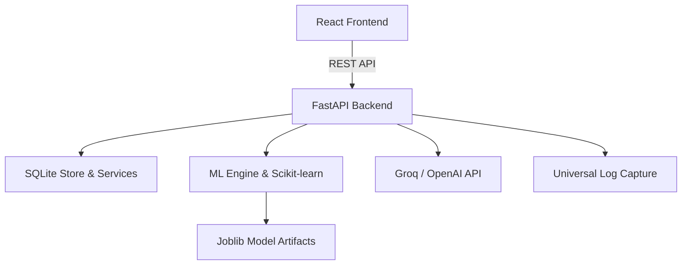

# DECISION-REWIND

DECISION-REWIND is a deterministic cybersecurity research prototype and application for identifying downstream decisions affected by corrected historical data. It replays decisions with a pinned model, selectively rewinds impacted outputs based on counterfactual execution, and verifies the resulting state.

> **Project status:** Research prototype / SIC Capstone Project.
>
> **Team members:**
>
> - Bhargav M — `1RN24CY009`
> - Saichetan M — `1RN24CY040`
> - Raghavendra Bhat B S — `1RN24CD057`
> - Shreya B K — `1RN24CD080`

---

## Overview

Security operations pipelines often make several dependent decisions from the same event data. If an upstream value is later corrected, recomputing every decision can create unnecessary or unsafe changes. DECISION-REWIND demonstrates a narrower workflow:

1. Generate deterministic synthetic cybersecurity events.
2. Train versioned classifiers on a 20,000-record training dataset.
3. Create a separate 200-record experiment pinned to one trained model artifact.
4. Correct one or more supported event features.
5. Replay the frozen model counterfactually.
6. Use provenance reachability and output differences to identify affected decisions.
7. Rewind only affected decisions.
8. Persist the correction, recovery, audit history, and deterministic verification result.
9. Optionally ask an evidence-grounded Groq-backed assistant to explain the persisted state.

The LLM is deliberately outside the recovery authority boundary: it can explain evidence, but it cannot approve, execute, or override recovery.

---

## Features

### Dataset & Experiment Management
- **Deterministic Generation:** Generates synthetic cybersecurity event datasets with configurable seeds.
- **Model Training:** Trains global models on exactly 20,000 records using a stratified 80/20 split.
- **Experiments:** Explicit creation of 200-record experiment datasets after a global model exists.
- **Experiment Labeling:** Labels experiments using a pinned, frozen model artifact for reproducibility.

### Decision Modeling
Five downstream decisions are modeled using Scikit-Learn:
- **D1 (Authentication):** Logistic Regression (Failed logins, login hour, geo anomaly, source IP trust)
- **D2 (Threat Severity):** Random Forest (Failed logins, threat intelligence score, previous alerts)
- **D3 (Asset Protection):** Decision Tree (Asset criticality, threat intelligence score, previous alerts)
- **D4 (Incident Escalation):** Logistic Regression (Threat intelligence score, geo anomaly, asset criticality, D2 severity)
- **D5 (Response Action):** Random Forest (D2 severity, asset criticality, geo anomaly, failed logins)
- *Note:* D2 is evaluated before D4 and D5 due to dependency graphs.

### Counterfactual Replay and Selective Recovery
- **Multi-Feature Correction Previews:** Preview the exact impact of changing inputs.
- **Dependency Paths:** NetworkX provenance graph for feature-to-decision reachability, displayed on the UI.
- **Selective Recovery:** Recovery is strictly limited to decisions that changed under replay AND are reachable from a corrected feature.
- **Immutability:** Historical outputs remain immutable during recovery operations.

### Verification and Observability
- **Audit Logging:** Universal JSON Lines application logs covering backend, frontend, API, model, workflow, and LLM events.
- **Deterministic Verification:** Assures correction and recovery persistence.
- **Redaction:** Automatic redaction of credential-like keys before log persistence.

### AI Explanations
- **Groq Integration:** Utilizes OpenAI-compatible Responses API backed by Groq.
- **Context-Aware:** Provides explanations based on bounded, filtered log context.
- **Safe Fallback:** Returns explicit errors when the provider is unconfigured, without fabricating responses.

---

## Tech Stack

| Area | Technology | Version |
| --- | --- | --- |
| **Backend Framework** | FastAPI | `0.111.0` |
| **ASGI Server** | Uvicorn | `0.30.1` |
| **Validation** | Pydantic | `2.9.2` |
| **Database** | SQLite | `Built-in` |
| **Data & Math** | Pandas, NumPy | `2.2.3`, `2.2.1` |
| **Machine Learning** | scikit-learn | `1.5.2` |
| **Artifacts** | joblib | `1.6.0` |
| **Graphs** | NetworkX | `3.6.0` |
| **Frontend Framework** | React | `18.3.1` |
| **Build Tool** | Vite | `5.4.2` |
| **Language** | TypeScript | `5.5.4` |
| **Styling** | Tailwind CSS | `3.4.13` |
| **Visualizations** | React Flow, Recharts | `11.4.2`, `2.12.7` |

---

## Architecture Overview

DECISION-REWIND follows a clear client-server architecture with a distinct machine learning pipeline for inference and counterfactual generation.



---

## Project Structure

```text
Decision_Rewind/
├── backend/
│   ├── app/                 # Main FastAPI backend application
│   │   ├── api/             # API routes
│   │   ├── dataset/         # Synthetic dataset generation
│   │   ├── llm/             # LLM integrations
│   │   ├── ml/              # Scikit-learn training and prediction
│   │   ├── provenance/      # NetworkX graph dependencies
│   │   ├── schemas/         # Pydantic models
│   │   ├── services/        # Business logic and persistence
│   │   └── main.py          # FastAPI entry point
│   └── requirements.txt
├── frontend-redesign/
│   ├── public/              # Static assets (Logos, Videos)
│   ├── src/                 # React frontend source
│   │   ├── App.tsx          # Main React Application
│   │   └── index.css        # Tailwind entry
│   ├── package.json
│   └── vite.config.ts
├── docs/                    # Project documentation
├── docker-compose.yml       # Docker deployment configuration
└── .env.example             # Environment variables template
```

---

## Installation

### Prerequisites
- Python 3.11+
- Node.js 20+ (for local development)
- Docker & Docker Compose (optional, but recommended)

### Quick Start (Docker)
1. Clone the repository.
2. Copy the `.env.example` to `.env` and configure your keys.
3. Start the application:
```bash
docker-compose up --build
```
The application will be accessible at:
- **Frontend:** http://localhost:5173
- **Backend API:** http://localhost:8000

---

## Running Locally (Without Docker)

### Backend
```bash
cd backend
python -m venv venv
source venv/bin/activate  # On Windows: venv\Scripts\activate
pip install -r requirements.txt
uvicorn app.main:app --host 0.0.0.0 --port 8000 --reload
```

### Frontend
```bash
cd frontend-redesign
npm install
npm run dev
```

---

## Configuration

Environment variables are used to configure the LLM provider and backend settings.

### `.env.example`
```env
APP_NAME=DECISION-REWIND
LLM_PROVIDER=groq
LLM_BASE_URL=https://api.groq.com/openai/v1
GROQ_API_KEY=your_api_key_here
LLM_MODEL=openai/gpt-oss-20b
TEMPERATURE=0.3
MAX_TOKENS=1024
```

| Variable | Required | Default | Purpose |
| --- | --- | --- | --- |
| `APP_NAME` | No | `DECISION-REWIND` | Identifier for the application. |
| `LLM_PROVIDER` | No | `groq` | The LLM provider to use for explanations. |
| `LLM_BASE_URL` | No | `https://api.groq.com/openai/v1` | Base URL for the OpenAI compatible API. |
| `GROQ_API_KEY` | **Yes** | `null` | API key for the AI functionality. |
| `LLM_MODEL` | No | `openai/gpt-oss-20b` | Target model for AI explanations. |

---

## Available Scripts

Defined in `frontend-redesign/package.json`:

- `npm run dev` - Starts the Vite development server on `0.0.0.0:5173`.
- `npm run build` - Compiles TypeScript and builds the production bundle via Vite.
- `npm run preview` - Serves the production build locally for testing.

---

## API Documentation

The backend provides a comprehensive REST API. Some core endpoints include:

- `GET /api/health`: Health check status.
- `POST /api/models/train`: Initiates a background job to train global ML models.
- `GET /api/models/status`: Retrieves the training status and available models.
- `POST /api/datasets`: Generates a new experimental dataset.
- `POST /api/datasets/{dataset_id}/train`: Evaluates the dataset using the pinned model.
- `POST /api/datasets/{dataset_id}/preview`: Previews a counterfactual correction.
- `POST /api/datasets/{dataset_id}/rewind`: Executes the selective decision rewind.
- `GET /api/datasets/{dataset_id}/graph`: Fetches the provenance graph for an experiment.
- `POST /api/ai/chat`: Queries the LLM with context for an explanation.

*For full API documentation, start the backend and visit the interactive Swagger UI at `http://localhost:8000/docs`.*

---

## Database

The application utilizes a local **SQLite** database (`decision_rewind.db`) created dynamically at runtime. It stores:
- **Models:** Metadata, validation metrics, and references to `joblib` artifacts.
- **Datasets & Events:** Synthetic events used for experiments and training.
- **Decisions & Corrections:** Historical inputs, counterfactuals, and recovery histories.
- **Audit Logs:** System-wide logs capturing API, ML, and frontend activity.

---

## Authentication & Security

- **Authentication:** The prototype currently does not implement user authentication (JWT/OAuth) as it operates as a local research workbench.
- **Security:** Universal logging implements automatic redaction for sensitive keys (e.g., stripping `GROQ_API_KEY` from request bodies). The LLM is heavily sandboxed and only provides *explanations*; it holds zero authority to execute data recovery.

---

## Troubleshooting

- **Dataset Not Training:** Ensure a global model is trained first via the UI or `POST /api/models/train` before attempting to run predictions on an experimental dataset.
- **AI Explanations Failing:** Verify that `GROQ_API_KEY` is provided in the `.env` file and that the container/app was restarted.
- **Missing Models on Restart:** SQLite and `.joblib` artifacts are stored in the local file system. If running in Docker without persistent volumes attached to `/app/backend/app/ml/trained` or `/app`, data will be lost on container recreation.

---

## License

This project is intended as a research prototype. (License not explicitly specified in the repository).

---

## Acknowledgements

- Built as part of a SIC Capstone Project.
- Leverages Scikit-Learn, FastAPI, React, and Vite.
